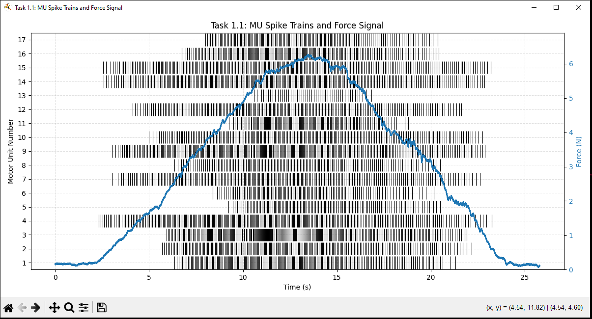
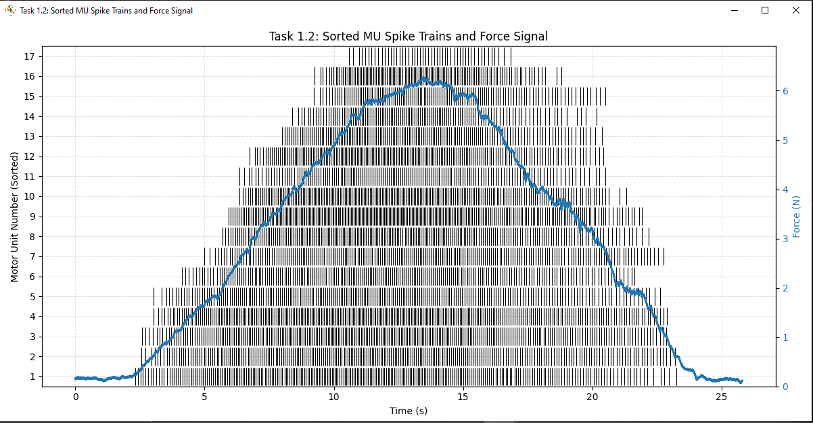
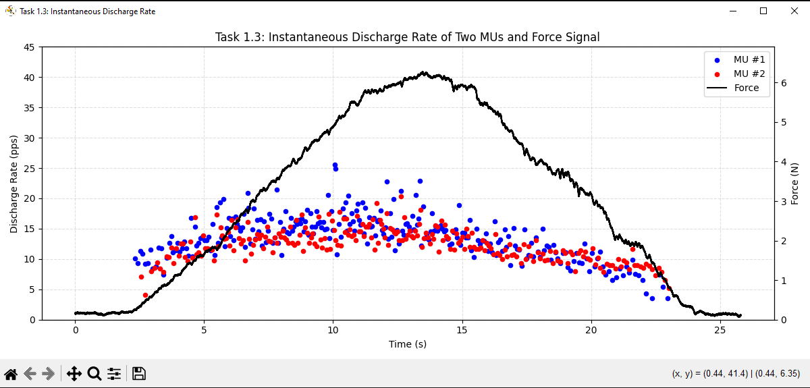
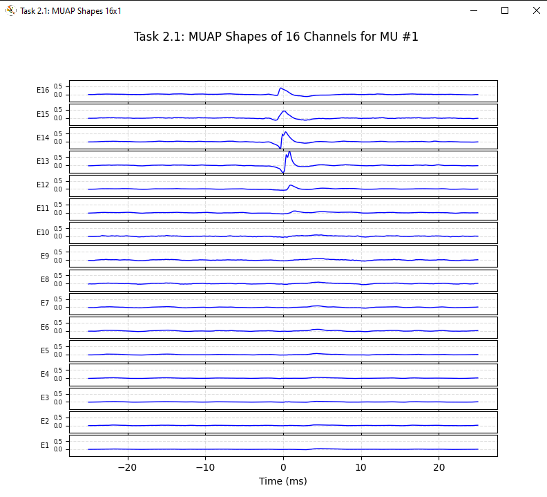
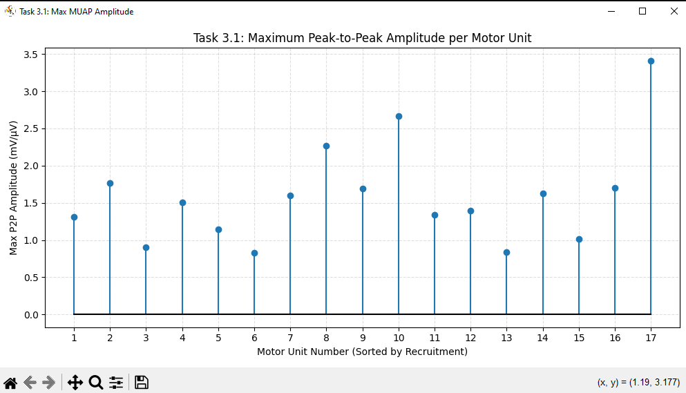
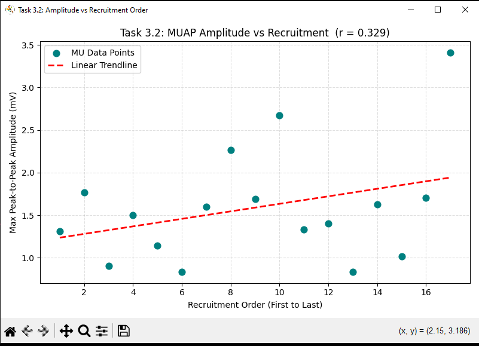
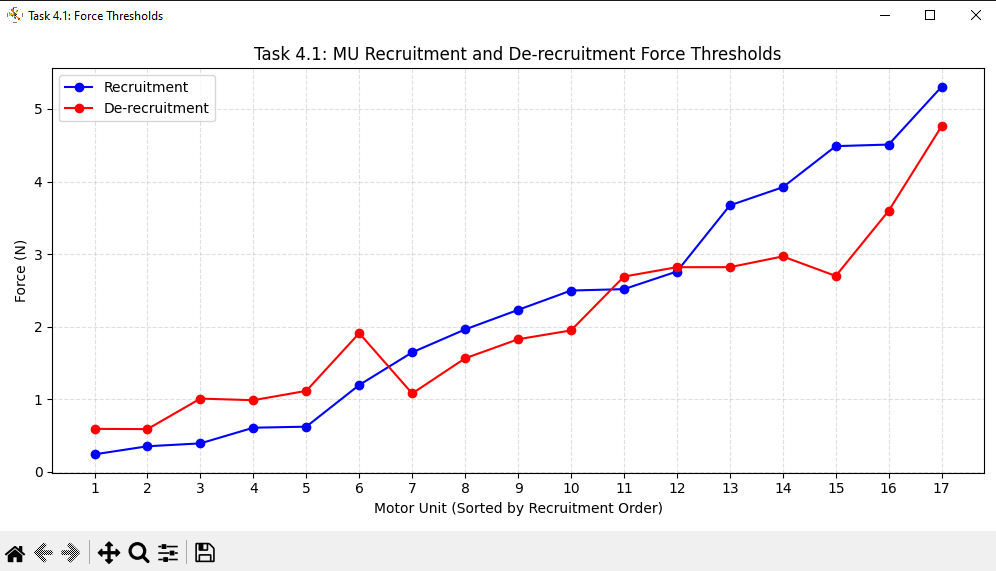
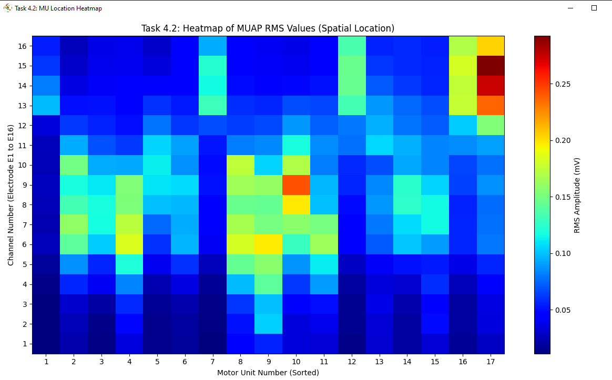

# 🧠 Motor Unit Spike Train & iEMG Analysis in Python

A Python-based pipeline for analysing **intramuscular EMG (iEMG)** contraction data, including motor unit spike train visualisation, MUAP morphology extraction via spike-triggered averaging, amplitude analysis, recruitment force thresholds, and spatial electrode mapping.

---

## 📋 Table of Contents

- [Overview](#overview)
- [Project Structure](#project-structure)
- [Requirements](#requirements)
- [Installation](#installation)
- [Pipeline Walkthrough](#pipeline-walkthrough)
- [Results](#results)
- [Usage](#usage)
- [Troubleshooting](#troubleshooting)

---

## Overview

This project processes decomposed iEMG recordings from a 16-channel electrode array during an isometric contraction task. The input data (`iEMG_contraction.mat`) contains:

- **MUPulses** — spike sample indices for each decomposed motor unit (MU)
- **EMGSig** — raw 16-channel EMG signals
- **force_signal** — the recorded muscle force output
- **fsamp** — sampling frequency in Hz

The pipeline produces 8 figures covering discharge behaviour, MUAP waveform shapes, amplitude–recruitment relationships, force thresholds, and a spatial RMS heatmap of the electrode array.

---

## Project Structure

```

├── iEMG_contraction.mat             # Input Data File (provide your own)
├── wrist_flexion_extension.mat      # Input Data File (provide your own)
├── MovementNeuroScience.py          # Main Analysis Script
├── Images                           # Figures and diagrams
│   └── 1.1.PNG
    └── 1.2.PNG
    └── 1.3.PNG
    └── 2.1.PNG
    └── 3.1.PNG
    └── 3.2.PNG
    └── 4.1.PNG
    └── 4.2.PNG
└── README.md
```

---

## Requirements

- Python 3.8+
- numpy
- scipy
- matplotlib
- h5py

---

## Installation

```bash
git clone https://github.com/your-username/your-repo-name.git
cd your-repo-name
pip install numpy scipy matplotlib h5py
python MovementNeuroscience.py
```

---

## Pipeline Walkthrough

### Task 1.1 — MU Spike Trains and Force Signal

All motor unit spike trains are plotted as a vertical-line raster on the left y-axis, with the recorded force signal overlaid on the right y-axis (dual y-axis layout).



---

### Task 1.2 — Sorted MU Spike Trains and Force Signal

Motor units are re-ordered by their first firing sample (recruitment order, earliest to latest) and the raster is re-plotted alongside the force signal.


---

### Task 1.3 — Instantaneous Discharge Rate (IDR)

The IDR (= 1 / inter-spike interval, in pulses per second) is computed for two representative motor units and plotted as a scatter chart alongside the force signal:

```
IDR = 1 / ISI     [pps]

```


---

### Task 2.1 — Spike-Triggered Averaging (STA) and MUAP Shapes

A ±25 ms window of EMG is averaged around every spike for each MU and channel, yielding the motor unit action potential (MUAP) waveform. The 16-channel MUAP shapes for MU #1 are displayed in a stacked subplot (E1 at bottom, E16 at top).



---

### Task 3.1 — Maximum Peak-to-Peak Amplitude

For each motor unit the peak-to-peak amplitude across all 16 channels is computed from the STA waveforms. The maximum value across channels is retained and displayed as a stem chart:

```
P2P = max(waveform) − min(waveform)

```

---

### Task 3.2 — Amplitude vs Recruitment Order

The maximum P2P amplitude is plotted against recruitment order as a scatter chart with a linear trendline. The **Pearson correlation coefficient (r)** is computed and shown in the figure title.

```
r = Pearson correlation between recruitment order and max P2P amplitude

```

---

### Task 4.1 — Recruitment and De-recruitment Force Thresholds

The force value at the **first** spike of each MU gives its recruitment threshold; the force at the **last** spike gives its de-recruitment threshold. Both are plotted together per MU:

| Marker | Meaning |
|---|---|
| 🔵 Blue | Recruitment threshold |
| 🔴 Red | De-recruitment threshold |



---

### Task 4.2 — MUAP RMS Heatmap (Spatial Location)

The RMS of each MU's MUAP waveform is computed for every electrode channel and displayed as a colour heatmap (16 channels × N motor units). High-amplitude regions indicate proximity of the MU to that part of the electrode array.

```
RMS = sqrt(mean(waveform²))

```

---

## Results

| Task | Metric | Value |
|---|---|---|
| 3.2 | Pearson r (amplitude vs recruitment) | Computed at runtime |
| 3.2 | p-value | Computed at runtime |

---

## Usage

Place `iEMG_contraction.mat` in the same directory as the script, then run:

```bash
python MovementNeuroscience.py
```

All 8 figures will open at the end. Console output will look like:

```
Loading data...
  EMGSig shape: (60000, 16)  (samples × channels)
  Motor units : 17
  Samples     : 60000
  Fs          : 2048.0 Hz

Task 1.1: MU spike raster + force...
Task 1.2: Sorted spike raster + force...
Task 1.3: Instantaneous discharge rate...
Task 2.1: Spike-triggered averaging...
Task 3.1: Max peak-to-peak amplitude...
Task 3.2: Amplitude vs recruitment order correlation...
  Pearson r = 0.6712  (p = 2.4680e-03)
Task 4.1: Force thresholds...
Task 4.2: RMS heatmap...

All tasks complete. Displaying figures...
```

---

## Troubleshooting

**`ModuleNotFoundError: No module named 'numpy'`**
Open the PyCharm terminal (it activates the venv automatically) and run:
```bash
pip install numpy scipy matplotlib h5py
```

**`NotImplementedError: Please use HDF reader for matlab v7.3 files`**
Your `.mat` file is in MATLAB v7.3 (HDF5) format. This is handled automatically as long as `h5py` is installed.

**`ValueError: setting an array element with a sequence`**
`EMGSig` has an unexpected layout in the v7.3 file. The script detects three possible layouts (flat 2-D array, HDF5 group, object array of vectors) and handles each. Check that the printed `EMGSig shape` shows `(n_samples, 16)`.

**Figures appear blank or empty**
Verify that `iEMG_contraction.mat` is in the same directory as the script and that the variable names match those listed in the Overview section.

---

## 📄 License

This project is for academic and research purposes.
